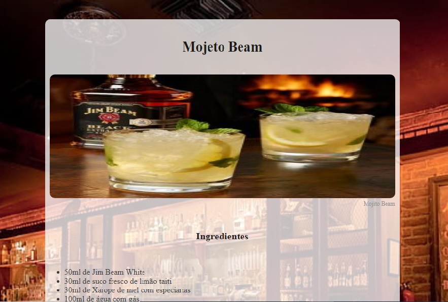

<h1 align="center"> Mojito Beam </h1>

Este é um projeto que consiste em criar uma página web com a receita de um drink utilizando HTML e CSS.

  <a href="#-tecnologias">Tecnologias</a>     |    
  <a href="#-projeto">Projeto</a>     |    
  <a href="#-layout">Layout</a>     |    
  <a href="#-licença">Licença</a>

  

## - 🚀Tecnologias
Esse projeto foi desenvolvido com as seguintes tecnologias:
- HTML
- CSS

## - 💻Projeto
O projeto está estruturado da seguinte forma:

*  index.html: arquivo HTML principal que contém a estrutura  da página.
*  style.css: arquivo CSS que define o estilo da página.
*  README.md: este arquivo que você está lendo.

## 🔖Layout 
Você pode visualizar o layout do projeto através da pasta assests dento do proprio projeto.

## - Licença

Esse projeto está sob a licença MIT.
----
Feito com ♥ por Tiago Lobo Paes.
